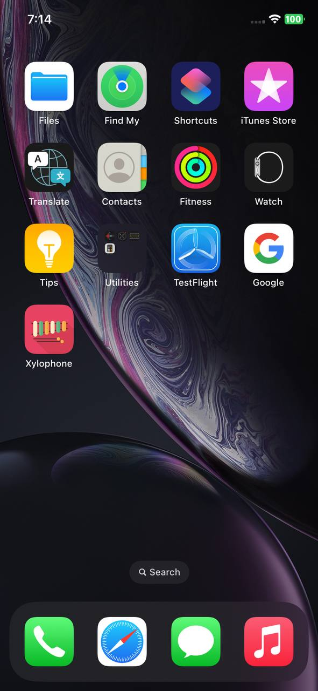
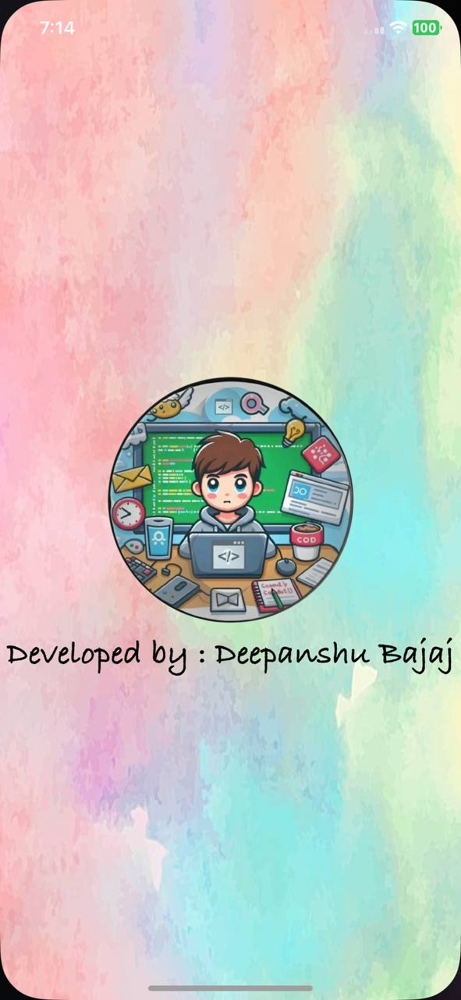
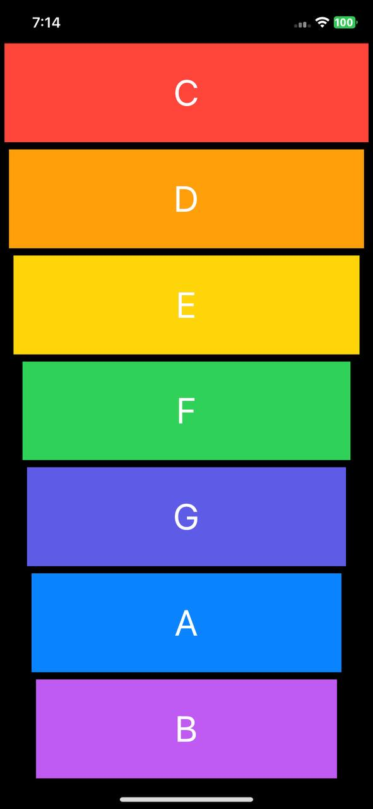

<h1 align="center">Xylophone - iOS App</h1>

**Xylophone** is a colorful iOS app that lets you create your own musical instrument! Play notes and chords on a vibrant, interactive xylophone, and explore your creativity in a fun and engaging way. Whether you’re a music enthusiast or just looking for a fun musical experience, this app is perfect for you!

## Features :

- **Play the Xylophone**: Tap the colorful bars to play individual notes, just like a real xylophone.
- **Interactive UI**: A simple and colorful design that makes playing music enjoyable for all ages.
- **Smooth Sound Experience**: High-quality sound samples for a real, authentic musical experience.
- **Customizable Sound**: Control volume and different sound effects for a personalized experience.

## Installation :

To run this project locally:

1. Clone the repository:
    ```bash
    git clone https://github.com/deepanshubajaj/Xylophone-iOSApp.git
    ```

2. Open the project in Xcode:
    ```bash
    open Xylophone.xcodeproj
    ```

3. Build and run the app on a simulator or physical device.

> Make sure you have Xcode installed and configured properly to run the project.

## App Look :

<p align="center">
  
</p>
<p align="center">
  *App snapshot in the simulator.*
</p>

## Screenshots :

<p align="center">
  
</p>
<p align="center">
  *Splash screen displayed upon app launch.*
</p>

<p align="center">
  
</p>
<p align="center">
  *Screenshot of the Xylophone app showing the main screen.*
</p>

## App Icon :

<p align="center">
  
</p>
<p align="center">
  *The app icon reflects the vibrant, musical theme of the Xylophone.*
</p>

## Video Demo :

Here’s a short video showcasing the app's functionality:

<p align="center">
  
</p>

[Watch Working Video](ProjectOutputs/WorkingVideo/workingVideo.mp4)
